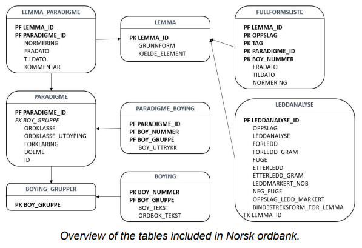

# Norsk ordbank

This is a mirror of the corpora "Norsk ordbank" published by [Språkbanken](https://www.nb.no/sprakbanken/), a register of the lemmas and lexemes of the Norwegian vocabulary developed to support language technology projects.

Norsk ordbank is created and maintained by [Språkrådet](https://sprakradet.no/om-sprakradet/sprakradets-arbeid/#English-version) and [University of Bergen](https://uib.no) under the [CC-BY license](https://creativecommons.org/licenses/by/4.0/).

## Norsk ordbank - bokmål 2005 (nob)

The directory `nob` contains the database for [Bokmål](https://en.wikipedia.org/wiki/Bokm%C3%A5l), reflecting the spelling reform of 2005.

University of Bergen has a [search interface for Norsk ordbank - bokmål](https://inger.uib.no/perl/search/search.cgi?appid=73&tabid=1116).

Please see [Språkbanken's web page](https://www.nb.no/sprakbanken/ressurskatalog/oai-nb-no-sbr-5/).

## Norsk ordbank - nynorsk 2012 (nno)

The directory `nno` contains the database for [Nynorsk](https://en.wikipedia.org/wiki/Nynorsk), reflecting the spelling reform of 2012.

University of Bergen has a [search interface for Norsk ordbank - bokmål](https://inger.uib.no/perl/search/search.cgi?appid=72&tabid=1106).

Please see [Språkbanken's web page](https://www.nb.no/sprakbanken/ressurskatalog/oai-nb-no-sbr-41/).

## Documentation

Norsk ordbank consists of a basic word list (lemma list) and a set of
inflection patterns. Each lemma has been assigned one or more inflection
patterns. Each pattern has a line for each possible inflected form of the
lemma. One line contains a conversion pattern and information about
syntactic category and morphosyntactic features. The pattern indicates how
the lemma can be expanded to an inflected form. The figure below shows
how the data is stored in practice; they are divided into 7 tables.

- The table ‘lemma’ contains all the lemmas in the dictionary including
an id number.
- The table ‘fullformsliste’ contains all possible inflected forms of all
lemmas according to the current official standard. This table also
includes potential forms with little or no actual usage.
- The tables ‘lemma_paradigme’, ‘paradigme’, ‘paradigme_boying’
(‘paradigm_inflection’), ‘boying_grupper’ (‘inflection groups’) and
‘boying’ (‘inflection’) contain the necessary information to generate full
forms based on the lemma list, i.e. they constitute the link between
lemma and inflection patterns, rules and grammatical information.

